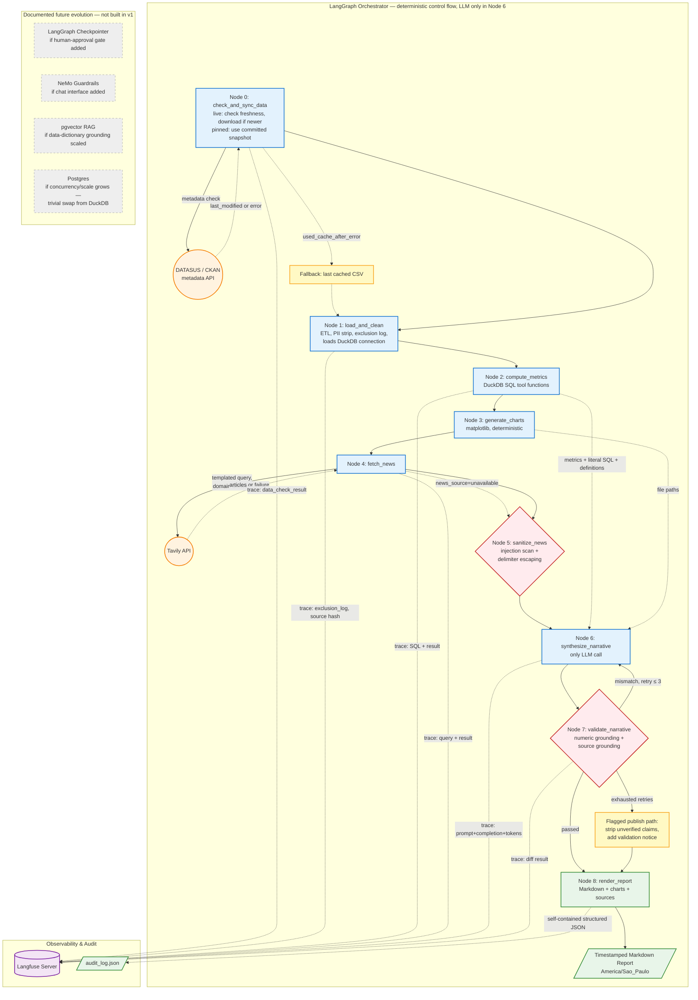

# SRAG Surveillance Report Agent

Generates automated SRAG (Severe Acute Respiratory Syndrome) reports. Uses open data from DATASUS and real-time news. Produces metrics, charts, and analytical narrative.

**95 unit tests | 19 Python modules | Mypy and Ruff — 0 errors**

---

## Architecture



The pipeline uses 11 LangGraph nodes in a fixed sequence:

- **Nodes 0–3**: Data and metrics. Loads CSV, strips PII, computes 4 DuckDB metrics, generates 2 charts.
- **Nodes 4–5**: News. Fetches from Tavily with a domain allowlist. Removes injected content.
- **Nodes 6–7**: Narrative and validation. Generates text with Google Gemini. Checks numbers and sources.
- **Nodes 8–10**: Report, audit, and trace. Creates Markdown, writes JSON log, sends trace to Langfuse.

All metrics use DuckDB functions. The LLM runs only in Node 6.

---

## How to Run

### Docker (all services)

```bash
docker compose --profile observability --profile pipeline up --build
```

### Local (pipeline only)

```bash
docker compose --profile observability up -d
python scripts/run_report.py
```

> Langfuse requires Docker. Without Docker, the pipeline runs without tracing.

### Prerequisites

- Python 3.14+
- `cp .env.example .env` — edit the API keys

---

## Environment Variables

| Variable | Required | Description |
|---|---|---|
| `GOOGLE_API_KEY` | Yes | Google Gemini API key |
| `TAVILY_API_KEY` | Yes | Tavily API key |
| `LANGFUSE_PUBLIC_KEY` | No | Langfuse public key |
| `LANGFUSE_SECRET_KEY` | No | Langfuse secret key |
| `LANGFUSE_HOST` | No | Langfuse URL (default: `http://localhost:3000`) |
| `DATA_MODE` | No | `pinned` (demo) or `live` (fresh data) |
| `LLM_TEMPERATURE` | No | LLM temperature (default: 0.2) |
| `TIMEZONE` | No | Timezone (default: America/Sao_Paulo) |

### CLI Arguments

```bash
python scripts/run_report.py --start-date 2026-01-01 --end-date 2026-07-27
```

Without arguments, the pipeline uses the last 12 months to today.

---

## Metrics

| Metric | Formula | Window |
|---|---|---|
| Case growth rate | (current 7d − prior 7d) / prior 7d × 100 | Rolling 7 days |
| Mortality rate | SRAG deaths / (SRAG deaths + recoveries) | 12 months |
| UTI admission rate | UTI=1 / HOSPITAL=1 | 12 months |
| Vaccination coverage | VACINA_COV=1 and VACINA=1 (hospitalized) | 12 months |

Vaccination: two separate rates (COVID-19 and Influenza). Population coverage via PNI is a future improvement.

### Charts

- **Line**: daily case count — last 30 days
- **Bar**: monthly case count — last 12 months

Both generated with Matplotlib.

---

## Guardrails

Three deterministic checks (no LLM involved):

1. **Numeric grounding** — extracts numbers from the narrative, normalizes comma to period, compares against metrics. Tolerance of ±0.01.
2. **Source grounding** — extracts URLs from the narrative, checks them against the news items. Unknown URLs are removed.
3. **Injection isolation** — untrusted content stays between `{{NEWS_CONTENT_START}}` and `{{NEWS_CONTENT_END}}`. The system prompt prohibits following instructions inside the block.

If validation fails, the pipeline retries (maximum 3 times). After 3 retries, the report publishes with a warning.

---

## Audit

Two complementary mechanisms:

1. **JSON audit log** at `outputs/logs/audit_log_{run_id}.json`. Contains: sync action, CSV hash, exclusion log, metrics with SQL queries, LLM prompt, validation diff, retry count.
2. **Langfuse** — visual trace of 11 nodes with spans, latency, and token counts.

---

## Architecture Decision Records (ADRs)

| ADR | Decision |
|---|---|
| **001** | DuckDB (OLAP) — aggregation queries on time windows |
| **002** | No RAG in v1 — news fits in the context window |
| **003** | No synthetic fallback — "No news" instead of fake content |
| **004** | Code-based guardrails, not NeMo — NeMo if chat is added later |
| **005** | Langfuse for tracing, not MLflow |
| **006** | CSV freshness check via HTTP HEAD on S3 |
| **007** | Curated domain allowlist for news (Fiocruz, gov.br, journalism) |

---

## Docker

### Services

- `postgres`, `clickhouse`, `redis` — Langfuse v3 infrastructure
- `langfuse` — LLM tracing (auto-creates org, project, and API keys)
- `srag-pipeline` — main pipeline

### Langfuse

On first run, API keys are created automatically.

- Login: `admin@example.com` / `admin1234`
- UI: http://localhost:3000/trace
- Predefined keys in `.env.example` (copy to `.env`)

---

## Repository Structure

```
.
├── .env.example           # Configuration template
├── Dockerfile             # Pipeline container
├── docker-compose.yml     # Service orchestration
├── pyproject.toml         # Dependencies
├── scripts/run_report.py  # CLI entry point
├── src/indicium_ai_agent/ # Source code (19 modules)
│   ├── config/            # Settings, metrics_spec, news_domains
│   ├── data/              # Nodes 0-1
│   ├── metrics/           # Node 2
│   ├── charts/            # Node 3
│   ├── news/              # Nodes 4-5
│   ├── narrative/         # Nodes 6-7
│   ├── render/            # Node 8
│   ├── logging/           # Nodes 9-10
│   ├── graph.py           # LangGraph
│   └── state.py           # ReportState
├── tests/                 # 95 tests
├── docs/                  # Documentation
└── outputs/               # Reports, logs, charts
```

---

## License

Proof of Concept (PoC) developed for Indicium HealthCare Inc.
