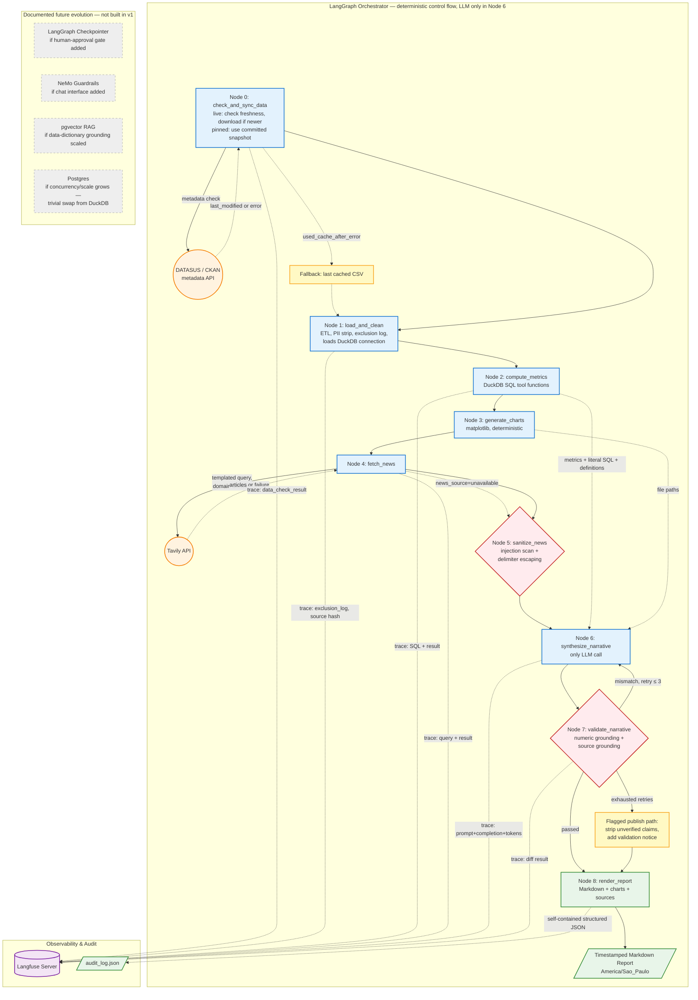

# Agente de Relatórios de Vigilância SRAG

Gera relatórios automáticos de SRAG (Síndrome Respiratória Aguda Grave). Usa dados abertos do DATASUS e notícias em tempo real. Produz métricas, gráficos e narrativa analítica.

**158 testes unitários | 30 fontes Python | Mypy e Ruff — 0 erros | Cobertura 86% (gate 80%)**

---

## Arquitetura



O pipeline usa 11 nós LangGraph em sequência fixa:

- **Nós 0–3**: Dados e métricas. Carrega CSV, limpa PII, calcula 4 métricas no DuckDB, gera 2 gráficos.
- **Nós 4–5**: Notícias. Busca no Tavily com lista de domínios definida. Remove conteúdo suspeito.
- **Nós 6–7**: Narrativa e validação. Gera texto com Google Gemini. Verifica números e fontes.
- **Nós 8–10**: Relatório, auditoria e rastreio. Gera Markdown, salva log JSON, envia trace para Langfuse.

Todas as métricas usam funções DuckDB. O LLM só é chamado no Nó 6.

---

## Como Executar

### Docker (todos os serviços)

```bash
docker compose --profile observability --profile pipeline up --build
```

### Local (só o pipeline)

```bash
docker compose --profile observability up -d
python scripts/run_report.py
```

> Langfuse precisa do Docker. Sem Docker, o pipeline funciona sem rastreio.

### Pré-requisitos

- Python 3.14+
- `cp .env.example .env` — edite as chaves de API

---

## Variáveis de Ambiente

| Variável | Obrigatória | Descrição |
|---|---|---|
| `GOOGLE_API_KEY` | Sim | Chave da API Google Gemini |
| `TAVILY_API_KEY` | Sim | Chave da API Tavily |
| `LANGFUSE_PUBLIC_KEY` | Não | Chave pública Langfuse |
| `LANGFUSE_SECRET_KEY` | Não | Chave secreta Langfuse |
| `LANGFUSE_HOST` | Não | URL do Langfuse (default: `http://localhost:3000`) |
| `DATA_MODE` | Não | `pinned` (demo) ou `live` (dados novos) |
| `LLM_TEMPERATURE` | Não | Temperatura do LLM (default: 0.2) |
| `TIMEZONE` | Não | Fuso horário (default: America/Sao_Paulo) |

### Argumentos CLI

```bash
python scripts/run_report.py --start-date 2026-01-01 --end-date 2026-07-27
```

Sem argumentos, usa os últimos 12 meses até a data atual.

---

## Métricas

| Métrica | Fórmula | Período |
|---|---|---|
| Taxa de aumento de casos | (casos 7d atuais − casos 7d anteriores) / anteriores × 100 | Rolante 7d |
| Taxa de mortalidade | óbitos SRAG / (óbitos SRAG + curas) | 12 meses |
| Taxa de internação em UTI | UTI=1 / HOSPITAL=1 | 12 meses |
| Taxa de vacinação | VACINA_COV=1 e VACINA=1 (hospitalizados) | 12 meses |

Vacinação: duas taxas separadas (COVID-19 e Influenza). Cobertura populacional via PNI é melhoria futura.

### Gráficos

- **Linha**: número diário de casos — últimos 30 dias
- **Barras**: número mensal de casos — últimos 12 meses

Ambos gerados com Matplotlib.

---

## Guardrails

Três verificações determinísticas (sem LLM):

1. **Ancoragem numérica** — extrai números da narrativa (filtrando anos e datas), canonicaliza vírgula para ponto, compara com as métricas. Tolerância absoluta de ±0.01 para valores zero e relativa de 1% para valores não-zero.
2. **Ancoragem de fontes** — extrai URLs da narrativa, verifica se existem nas notícias. URLs não encontradas são removidas.
3. **Isolamento de injeção** — conteúdo não confiável fica entre `{{NEWS_CONTENT_START}}` e `{{NEWS_CONTENT_END}}`. O prompt do modelo proíbe seguir instruções dentro do bloco.

Se a validação falha, o pipeline tenta de novo (máximo 3 vezes). Depois de 3 tentativas, o relatório é publicado com um aviso.

---

## Auditoria

Dois mecanismos complementares:

1. **JSON de auditoria** em `outputs/logs/audit_log_{run_id}.json`. Contém: ação de sincronia, hash do CSV, log de exclusões, métricas com queries SQL, prompt do LLM, diff de validação, contagem de tentativas.
2. **Langfuse** — rastreio visual dos 11 nós com spans, latência e tokens.

---

## Registro de Decisões (ADRs)

| ADR | Decisão |
|---|---|
| **001** | DuckDB (OLAP) — consultas de agregação sobre janelas de tempo |
| **002** | Sem RAG em v1 — notícias cabem no contexto direto |
| **003** | Sem fallback sintético — "Nenhuma notícia" em vez de conteúdo falso |
| **004** | Guardrails em código, não NeMo — NeMo se houver chat no futuro |
| **005** | Langfuse para rastreio, não MLflow |
| **006** | Verificação de frescor do CSV via HTTP HEAD no S3 |
| **007** | Lista de domínios curada para notícias (Fiocruz, gov.br, jornalismo) |

---

## Docker

### Serviços

- `postgres`, `clickhouse`, `redis` — infraestrutura do Langfuse v3
- `langfuse` — rastreio LLM (auto-inicia organização, projeto e chaves)
- `srag-pipeline` — pipeline principal

### Langfuse

Na primeira execução, as chaves de API são criadas automaticamente.

- Login: `admin@example.com` / `admin1234`
- UI: http://localhost:3000/trace
- Chaves pré-definidas em `.env.example` (copiar para `.env`)

---

## Estrutura

```
.
├── .env.example           # Template de configuração
├── Dockerfile             # Container do pipeline
├── docker-compose.yml     # Orquestração de serviços
├── pyproject.toml         # Dependências
├── scripts/run_report.py  # Ponto de entrada CLI
├── src/indicium_ai_agent/ # Código fonte (19 módulos)
│   ├── config/            # Settings, metrics_spec, news_domains
│   ├── data/              # Nós 0-1
│   ├── metrics/           # Nó 2
│   ├── charts/            # Nó 3
│   ├── news/              # Nós 4-5
│   ├── narrative/         # Nós 6-7
│   ├── render/            # Nó 8
│   ├── logging/           # Nós 9-10
│   ├── graph.py           # LangGraph
│   └── state.py           # ReportState
├── tests/                 # 158 testes
├── docs/                  # Documentação
└── outputs/               # Relatórios, logs, gráficos
```

---

## Licença

Projeto desenvolvido como Prova de Conceito (PoC) para a Indicium HealthCare Inc.
