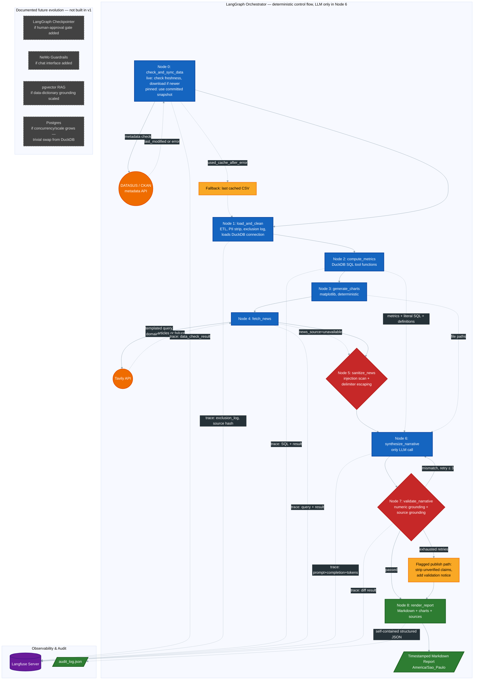

```mermaid
%%{init: {'theme':'base','themeVariables':{'lineColor':'#90a4ae','edgeLabelBackground':'#263238','primaryTextColor':'#ffffff'}}}%%
flowchart TD
    classDef process fill:#1565c0,stroke:#0d47a1,color:#ffffff,stroke-width:2.5px;
    classDef external fill:#ef6c00,stroke:#e65100,color:#ffffff,stroke-width:2.5px;
    classDef output fill:#2e7d32,stroke:#1b5e20,color:#ffffff,stroke-width:2.5px;
    classDef guardrail fill:#c62828,stroke:#b71c1c,color:#ffffff,stroke-width:2.5px;
    classDef telemetry fill:#6a1b9a,stroke:#4a148c,color:#ffffff,stroke-width:2.5px;
    classDef future fill:#424242,stroke:#757575,color:#e0e0e0,stroke-width:1.5px,stroke-dasharray:5 5;
    classDef errorpath fill:#f9a825,stroke:#f57f17,color:#000000,stroke-width:2.5px;

    subgraph Graph [LangGraph Orchestrator — deterministic control flow, LLM only in Node 6]
        NodeSync[Node 0: check_and_sync_data<br/>live: check freshness, download if newer<br/>pinned: use committed snapshot]:::process
        NodeSync -->|metadata check| CKAN((DATASUS / CKAN<br/>metadata API)):::external
        CKAN -.->|last_modified or error| NodeSync
        NodeSync -.->|used_cache_after_error| NodeSyncFallback[Fallback: last cached CSV]:::errorpath
        NodeSyncFallback -.-> NodeLoad
        NodeSync --> NodeLoad

        NodeLoad[Node 1: load_and_clean<br/>ETL, PII strip, exclusion log,<br/>loads DuckDB connection]:::process
        NodeLoad --> NodeMetrics

        NodeMetrics[Node 2: compute_metrics<br/>DuckDB SQL tool functions]:::process
        NodeMetrics --> NodeChart[Node 3: generate_charts<br/>matplotlib, deterministic]:::process
        NodeChart --> NodeNews[Node 4: fetch_news]:::process

        NodeNews -->|templated query,<br/>domain allowlist| Tavily((Tavily API)):::external
        Tavily -.->|articles or failure| NodeNews
        NodeNews -.->|news_source=unavailable| NodeSanitize

        NodeNews --> NodeSanitize{Node 5: sanitize_news<br/>injection scan +<br/>delimiter escaping}:::guardrail
        NodeSanitize --> NodeReport[Node 6: synthesize_narrative<br/>only LLM call]:::process

        NodeMetrics -.->|metrics + literal SQL + definitions| NodeReport
        NodeChart -.->|file paths| NodeReport

        NodeReport --> NodeValidate{Node 7: validate_narrative<br/>numeric grounding +<br/>source grounding}:::guardrail
        NodeValidate -- mismatch, retry ≤ 3 --> NodeReport
        NodeValidate -- exhausted retries --> NodeFlagged[Flagged publish path:<br/>strip unverified claims,<br/>add validation notice]:::errorpath
        NodeValidate -- passed --> NodeRender[Node 8: render_report<br/>Markdown + charts + sources]:::output
        NodeFlagged --> NodeRender

        NodeRender --> FinalReport[/Timestamped Markdown Report<br/>America/Sao_Paulo/]:::output
    end

    subgraph Observability [Observability & Audit]
        NodeSync -.->|trace: data_check_result| Langfuse[(Langfuse Server)]:::telemetry
        NodeLoad -.->|trace: exclusion_log, source hash| Langfuse
        NodeMetrics -.->|trace: SQL + result| Langfuse
        NodeNews -.->|trace: query + result| Langfuse
        NodeReport -.->|trace: prompt+completion+tokens| Langfuse
        NodeValidate -.->|trace: diff result| Langfuse
        NodeRender -.->|self-contained structured JSON| AuditLog[/audit_log.json/]:::output
    end

    subgraph FutureWork [Documented future evolution — not built in v1]
        Checkpointer[LangGraph Checkpointer<br/>if human-approval gate added]:::future
        NeMo[NeMo Guardrails<br/>if chat interface added]:::future
        VectorDB[pgvector RAG<br/>if data-dictionary grounding scaled]:::future
        RealDB[Postgres<br/>if concurrency/scale grows —<br/>trivial swap from DuckDB]:::future
    end
```
