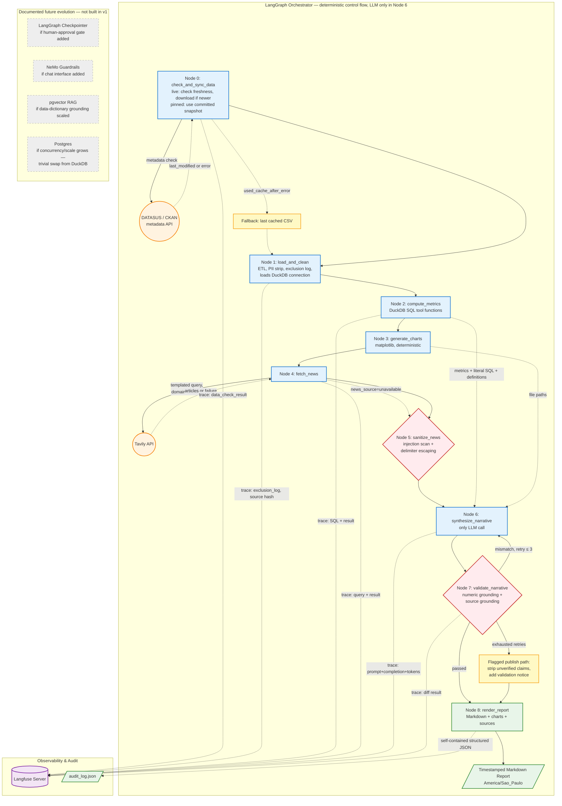

# SRAG Surveillance Report Agent — Architecture Plan (v3, final)

> Status: finalized. All open decisions (§11) resolved; ready to serve as
> the basis for the README and the required architecture PDF, and as the
> implementation reference.
> Context: PoC for Indicium HealthCare Inc. — agentic report generator for SRAG
> outbreak metrics, grounded in Open DATASUS data + real-time news.

---

## 0. How this document maps to the grading criteria

| Grading criterion | Where it's addressed |
|---|---|
| Escolha da arquitetura | §2 (decisions + ADR log), §10 (diagram) |
| Governança e Transparência | §6 (audit trail), §7 (ADR log), every node in §5 logs to Langfuse + JSON |
| Guardrails | §8 (three guardrails: numeric grounding, injection isolation, source grounding), §5.4/ADR-007 (curated news domain allowlist shrinks injection attack surface) |
| Uso de Tools | §5 (deterministic tool functions per node), §4 (DuckDB-backed metric tools) |
| Tratamento de Dados Sensíveis | §3.3 (data minimization) |
| Clean Code | §9 (pure-node testability standard, metrics_spec single source of truth) |

Keeping this mapping explicit is intentional — a reviewer should be able to find
evidence for each criterion without inferring it from prose.

---

## 1. Problem framing

Generate a Markdown report on SRAG outbreak status: four deterministic metrics
computed from the Open DATASUS SRAG dataset (~165k rows, ~100 columns, real
data-quality issues), two charts, and an LLM-generated narrative grounded in
the metrics and in real-time news (Tavily).

---

## 2. Key architectural decisions

| Decision | Choice (final) | Rationale |
|---|---|---|
| Data layer | **DuckDB** (OLAP, embedded), querying a loaded/cleaned DataFrame or Parquet file directly | DuckDB's columnar/vectorized engine matches this workload's actual access pattern — scan-and-aggregate analytical queries, not transactional row-level read/writes — making it the right database *category*, not just a technicality to satisfy "consultar o banco de dados." Produces real, parameter-bound SQL strings usable directly as audit artifacts. Migration path to Postgres/ClickHouse later is a connection-layer change, not a rewrite. See ADR-001. |
| Orchestration | LangGraph, explicit deterministic state machine | LLM used only for narrative synthesis; the sequence of steps is fixed and inspectable. This is a deliberate "deterministic agent" pattern — the brief asks for an agent that consults data/news via tools, not one that freely chooses its own workflow. Governance benefit: every step is independently testable and traceable. |
| Tool design | Predefined parameterized functions, DuckDB SQL under the hood | No text-to-SQL, no freeform query generation — removes injection/hallucination risk against real health data. |
| News retrieval | Tavily API, constrained to a curated domain allowlist (Fiocruz/InfoGripe, Ministério da Saúde, reputable Brazilian journalism), with explicit-absence fallback (not synthetic content) | Purpose-built API, legitimate ToS. InfoGripe (Fiocruz) analyzes the same SIVEP-Gripe data underlying this project's dataset, making it a substantively stronger source than open web search. On failure/empty result, the pipeline declares "no news context available" rather than substituting generic text. See ADR-003, ADR-007, §5.4. |
| Charts | Matplotlib, deterministic, LLM only narrates | Removes "chart doesn't match claimed data" failure class entirely. |
| RAG / vector DB | Skipped for v1 | News set is small enough to fit directly in context; data dictionary small enough for direct system-prompt injection. Documented as stretch goal only (data dictionary embedding), not prioritized. |
| Guardrails | Code-based (three checks, §8), not NeMo Guardrails | NeMo's strengths (dialog rails, intent detection) target multi-turn conversation, which this batch-only system doesn't have. Documented as upgrade path if a chat interface is added. |
| Observability | Langfuse + structured JSON audit log | Langfuse is purpose-built for LLM/agent tracing; MLflow's core strength (experiment/model comparison) isn't relevant to a single fixed pipeline. |
| Checkpointer | Not used in v1 | Single linear batch run, no pause/resume or human-in-the-loop requirement. Documented as future work if a human-approval-before-publish gate is added. |
| Report format | Timestamped Markdown, relative image paths, GitHub-renderable | No separate PDF rendering pipeline needed for the report itself (the architecture diagram is the one required PDF). |
| Execution | CLI script | No UI/API required by the brief. |
| Timezone | `America/Sao_Paulo` fixed for all timestamps | DATASUS and the operating context are Brazil-based; avoids confusion if run in a different timezone. |
| Reproducibility | Pinned CSV snapshot committed for demo purposes + live-data mode documented separately | DATASUS updates frequently; a grader re-running against live data would see different numbers and might mistake data drift for a bug. |
| LLM provider | Google Gemini (Google AI Studio free tier) via LangChain's provider-agnostic `ChatModel` interface | Frontier-class instruction-following matters more than throughput for a single grounding-sensitive call per run; free tier's prompt-training tradeoff is low-risk here since only aggregated metrics/public news ever reach the model. Groq documented as a fast option for dev-time guardrail testing, not production narrative synthesis. |
| Data freshness | **Node 0: check_and_sync_data**, metadata-based freshness check against the DATASUS/CKAN source before every live run | Directly supports the brief's "entendimento em tempo real" framing — the pipeline verifies it's working from the latest published data rather than a possibly-stale local file, without re-downloading the full CSV on every run. See ADR-006, §3.5. |

---

## 3. Data layer detail

### 3.1 Column selection — confirmed against the official SIVEP-Gripe data dictionary

Source: `dicionario-de-dados-2019-a-2025.pdf` (Ministério da Saúde /
SIVEP-Gripe). Column names below are the actual field names, not
placeholders — this closes the "pending confirmation" item from earlier
drafts.

| Purpose | Column(s) | Notes |
|---|---|---|
| Symptom onset date (canonical date for growth-rate calc) | `DT_SIN_PRI` | Confirmed — matches earlier assumption. |
| Notification date / entry date (for lag comparison, not used as canonical) | `DT_NOTIFIC`, `DT_DIGITA` | `DT_DIGITA` is system entry date, explicitly **not** updated on later edits — good for measuring reporting lag, bad as a case-count anchor. |
| Case outcome | `EVOLUCAO` — coded `1=Cura`, `2=Óbito`, `3=Óbito por outras causas`, `9=Ignorado`; `DT_EVOLUCA` = date of discharge/death | **Correction from earlier draft**: codes are numeric, not string labels — mortality query must filter/compare on `1`, `2`, `3`, `9`, not `'cura'`/`'obito'`. Mortality numerator should likely use `EVOLUCAO = 2` only (death from SRAG itself); whether to include `3` (death from other causes) in the denominator or exclude it entirely is a modeling decision to state explicitly in the metrics spec. |
| Hospitalization flag / date | `HOSPITAL` (1/2/9), `DT_INTERNA` | |
| ICU admission flag / dates | `UTI` (1=Sim, 2=Não, 9=Ignorado), `DT_ENTUTI`, `DT_SAIDUTI` | Confirmed — matches earlier assumption. Entry/exit dates exist but true bed-occupancy (concurrent census) still isn't derivable from this — confirms the earlier decision to relabel this metric as an admission rate, not occupancy. |
| Vaccination — **two separate fields, not one** | `VACINA_COV` (COVID-19 vaccine, 1/2/9) and `VACINA` (seasonal flu vaccine, "última campanha", 1/2/9) | **New finding, not previously known**: the dataset tracks COVID-19 and influenza vaccination as two independent fields. This directly affects the §3.4 vaccination-rate ambiguity — need to decide (or state as a documented assumption) which vaccine "taxa de vacinação" refers to, since SRAG can be caused by either pathogen (see `CLASSI_FIN` below). Detailed dose-date/manufacturer/lot fields (`DOSE_1_COV`, `FAB_COV1`, etc.) exist but are out of scope — no metric needs them, and lot/manufacturer data adds no analytical value here. |
| Case classification (etiology) | `CLASSI_FIN` — `1=SRAG por influenza`, `2=SRAG por outro vírus respiratório`, `3=SRAG por outro agente etiológico`, `4=SRAG não especificado`, `5=SRAG por covid-19` | Useful optional context: could stratify metrics by cause (e.g., "vaccination rate among COVID-attributed cases" vs. "flu-attributed cases") if time allows. Not required for the four core metrics as specified. |
| Geography | `SG_UF_NOT` (UF of notifying unit) or `SG_UF` (UF of patient residence) | Two different UF fields exist; residence (`SG_UF`) is more representative for population-level framing, notification UF (`SG_UF_NOT`) reflects where care was given. Pick `SG_UF` as primary, document the choice. |

**Excluded by design — confirmed PII fields found in the dictionary**:
`NU_CPF`, `NU_CNS`, `NM_PACIENT`, `NM_MAE_PAC`, `NU_CEP`, `NM_BAIRRO`,
`NM_LOGRADO`, `NU_NUMERO`, `NM_COMPLEM`, `NU_DDD_TEL`/`NU_TELEFON`,
`DT_NASC` (exact birth date — use `NU_IDADE_N`/`TP_IDADE`, the
pre-computed age value, instead of deriving age from birth date),
`NOME_PROF`/`REG_PROF` (health professional's own name/registration — staff
PII, not patient PII, but excluded on the same principle).

### 3.2 Data quality strategy
- Explicit inclusion/exclusion rules per metric, each logging a count and
  reason — not silent global cleaning.
- Cleaning happens exactly once per run (§5.2, shared-state pattern); every
  metric is computed against an identical cleaned dataset.
- Extraction date and source file hash logged alongside the cleaned dataset,
  so a grader can distinguish "the code broke" from "the source data changed."

### 3.3 Sensitive data strategy (data minimization)
- PII/direct identifiers dropped or bucketed at load time, before anything is
  held in the working dataset or reaches an LLM prompt.
- No free text, no exact birth date (age bucket only if used at all), no
  individual-level rows ever passed into any prompt — only pre-aggregated
  metric values and news text reach the LLM.
- **Finding from the DATASUS portal's own documentation**: published SRAG
  data already goes through an anonymization step to comply with LGPD
  before public release — meaning direct identifiers (`NU_CPF`, `NM_PACIENT`,
  `NU_CNS`, `NM_MAE_PAC`, etc., all documented in the internal system
  dictionary in §3.1) may already be stripped or nulled in the actual
  published CSV, even though they're part of the underlying system's field
  list. **Day 1 verification task**: confirm, column by column, which of
  these fields are genuinely absent vs. merely nulled vs. still present in
  the public file — the data-minimization step stays in place as a
  defensive check either way (verify absence, don't just assume it), but
  this changes how much active stripping work is actually needed.
- README includes an explicit data-minimization checklist: which columns are
  kept, why each one is necessary for a specific metric, and which
  PII-adjacent columns were confirmed absent vs. actively dropped.

### 3.4 Vaccination rate — final decision

The dictionary confirmed a complication not visible before: SIVEP-Gripe
tracks **two separate vaccination fields** — `VACINA_COV` (COVID-19) and
`VACINA` (seasonal influenza) — because SRAG can be attributed to either
pathogen (see `CLASSI_FIN` in §3.1). The brief's "taxa de vacinação da
população" doesn't specify which.

**Decision (final)**: report both, clearly labeled — "cobertura vacinal
COVID-19" and "cobertura vacinal Influenza" — sourced from a population-level
reference dataset (DATASUS/PNI) rather than hospitalized-case status. This is
the most complete and accurate answer to what the brief actually asks for,
now correctly scoped to both pathogens capable of causing SRAG rather than
silently picking one.

**Implementation implication**: locating and joining the PNI coverage
dataset (by UF/period) is now a Day 1 task, not a stretch goal — it's the
committed path, not a nice-to-have upgrade over a fallback. If the join
proves harder than expected within Day 1's time budget, the documented
fallback is to compute both hospitalized-case vaccination rates
(`VACINA_COV` and `VACINA` among SRAG cases) instead, explicitly relabeled
as "proporção de casos hospitalizados com esquema vacinal completo" for
each — never presented as population coverage. This fallback exists as a
safety net for the timeline, not as an equally-preferred alternative.

Time-box the PNI join attempt on Day 1: if it's not working within a fixed
budget (e.g., half a day), switch to the hospitalized-case fallback
immediately rather than letting it block the rest of the pipeline — the
fallback is fully specified and ready to implement without further
decisions if needed.

### 3.5 CSV freshness check — Node 0

Goal: before running a report, verify the local dataset is the most recent
one published by DATASUS, and only re-download when it isn't — without
pulling the full ~165k-row CSV on every run just to check.

**Preferred mechanism**: `dadosabertos.saude.gov.br` follows the same CKAN
platform pattern used across Brazilian government open-data portals (e.g.
ANEEL, CAPES, BNDES, state portals all expose the standard
`/api/3/action/...` CKAN action API). CKAN exposes dataset/resource metadata
— including a last-modified timestamp — via a lightweight metadata call
(`package_show` / `resource_show`), separate from downloading the resource
itself. **To confirm on Day 1**: the exact resource ID and whether this
specific portal's CKAN API is publicly reachable the same way — treated as
a verification task, not an assumption baked into the design.

**Flow**:

1. **Mode check**: if running in `pinned` mode (default for demo/reproducible
   runs), skip the freshness check entirely and use the committed snapshot.
   Only `live` mode performs the check below.
2. **Metadata check**: call the CKAN metadata endpoint for the SRAG resource,
   read its last-modified/revision timestamp. This is a small JSON response,
   not a CSV download.
3. **Compare**: read the locally cached metadata file (`cache/csv_metadata.json`
   — remote last-modified timestamp + sha256 hash from the last successful
   download). If the remote timestamp is newer than the cached one (or no
   cache exists yet):
   - Download the full CSV, compute its sha256 hash, save it to the raw-data
     path, and update the cache metadata file.
   - `data_check_result.action = "downloaded"`.
4. **No update needed**: if the remote timestamp is not newer, skip the
   download and reuse the existing local CSV.
   - `data_check_result.action = "cached_up_to_date"`.
5. **Graceful degradation on failure**: if the metadata endpoint or the
   download itself fails (network issue, API change, timeout), the pipeline
   does **not** hard-fail the report run. It falls back to the most recent
   locally cached CSV, if one exists, and logs a clear warning + the failure
   reason.
   - `data_check_result.action = "used_cache_after_error"`.
   - If no local cache exists at all (e.g., first-ever run with no network),
     this is the one case that legitimately blocks the run — there's no
     data to report on — and the failure is surfaced clearly rather than
     silently producing an empty report.
6. **Output feeds Node 1**: `load_and_clean` reads from whatever path Node 0
   resolved (freshly downloaded or cached), rather than a hardcoded file.

This whole step is logged like every other node — source URL, check
timestamp, remote vs. cached last-modified value, and the action taken all
go into the structured JSON audit log and the Langfuse trace, so "was this
report built on the latest data or a cached copy, and why" is always
answerable after the fact.

---

## 4. Metrics spec (single source of truth)

Implemented as `metrics_spec.py`, imported by both the DuckDB-backed tool
functions and the node 6 prompt template — computation and narrated
definition can never drift apart.

Every metric function returns a uniform, auditable shape, handling the
zero-denominator case explicitly instead of raising or returning `inf`:

```python
{
    "value": 0.15,              # or None if not computable
    "computable": True,         # False if denominator == 0
    "numerator": 21,
    "denominator": 142,
    "period": "2024-01-01 to 2024-01-31",
    "definition_ref": "mortality_rate_v1",
    "query": "SELECT ... FROM srag WHERE ..."   # literal SQL, for audit log
}
```

If `computable` is `False`, the report renders "Dados insuficientes para
cálculo neste período" instead of crashing or displaying a nonsensical value.

| Metric | Formula (confirmed) | Window | Caveat |
|---|---|---|---|
| Taxa de aumento de casos | (casos últimos 7d − casos 7d anteriores) / casos 7d anteriores × 100, anchored on `DT_SIN_PRI` | Rolling 7d vs prior 7d | Most recent ~7–14 days under-reported (notification lag); disclosed in report. `computable=False` if prior-window count is 0. |
| Taxa de mortalidade | óbitos / (óbitos + curas) using `EVOLUCAO` (`2`=óbito por SRAG, `1`=cura); `3`=óbito por outras causas excluded from both numerator and denominator (final, signed off — §11); `9`/unresolved excluded from denominator | Configurable, default 12 months | Excluded count logged. `computable=False` if denominator is 0. |
| Taxa de internação em UTI entre casos de SRAG (relabeled from "ocupação") | casos com `UTI = 1` (Sim) / total casos com `HOSPITAL = 1` | Same as above | Renamed deliberately — dataset can't support true bed-occupancy; report heading reflects the actual metric, not the brief's original wording. |
| Taxa de vacinação | Both `VACINA_COV` (COVID-19) and `VACINA` (influenza), population-level coverage via DATASUS/PNI join by UF/period (final decision — §3.4/§11); hospitalized-case fallback specified and ready if the PNI join is time-boxed out | Matches PNI data periodicity, confirmed on Day 1 | Two separate rates reported, each clearly labeled by pathogen — never conflated into one number |

Example DuckDB-backed tool function:

```python
import duckdb

def get_mortality_rate(con: duckdb.DuckDBPyConnection, start: str, end: str) -> dict:
    # EVOLUCAO codes (confirmed from official dictionary):
    # 1 = Cura, 2 = Óbito (by SRAG), 3 = Óbito por outras causas, 9 = Ignorado
    # Deliberate modeling choice: numerator counts EVOLUCAO=2 only;
    # EVOLUCAO=3 (death from unrelated causes) is excluded from both
    # numerator and denominator, not folded into "cura". This choice is
    # documented in metrics_spec.py, not just in code.
    query = """
        SELECT
            SUM(CASE WHEN evolucao = 2 THEN 1 ELSE 0 END) AS obitos,
            SUM(CASE WHEN evolucao IN (1, 2) THEN 1 ELSE 0 END) AS resolvidos
        FROM srag
        WHERE dt_sin_pri >= ? AND dt_sin_pri < ?
    """
    obitos, resolvidos = con.execute(query, [start, end]).fetchone()
    computable = resolvidos > 0
    return {
        "value": (obitos / resolvidos) if computable else None,
        "computable": computable,
        "numerator": obitos,
        "denominator": resolvidos,
        "period": f"{start} to {end}",
        "definition_ref": "mortality_rate_v1",
        "query": query,
    }
```

---

## 5. Orchestration detail (LangGraph)

### 5.1 Shared state schema

```python
class ReportState(TypedDict):
    data_mode: Literal["live", "pinned"]
    data_source_url: str              # DATASUS/CKAN resource URL
    data_check_result: dict           # {action, remote_last_modified,
                                       #  cached_last_modified, checked_at,
                                       #  error: Optional[str]}
    raw_csv_path: str                 # resolved by Node 0, consumed by Node 1
    con: duckdb.DuckDBPyConnection   # DuckDB connection over cleaned data, set once
    exclusion_log: dict              # {rule_name: {excluded_count, reason}}
    metrics: dict                    # {metric_name: <uniform metric dict, see §4>}
    chart_paths: dict                # {"daily": "path.png", "monthly": "path.png"}
    news_items: list[dict]           # [{title, url, source, published_date, snippet}]
    news_source: Literal["tavily", "unavailable"]
    news_flagged: bool               # True if injection scan found suspicious content
    narrative_draft: str
    narrative_validated: str
    validation_passed: bool
    validation_diff: dict            # what mismatched, for audit
    retry_count: int
    run_id: str
    source_csv_hash: str
    source_extraction_date: str
    timezone: str                    # "America/Sao_Paulo", fixed
```

### 5.2 Node sequence

0. **check_and_sync_data** — see §3.5 in full. In `live` mode, checks the
   DATASUS/CKAN resource's metadata for a newer publish timestamp than the
   locally cached copy; downloads only if newer; falls back gracefully to
   the last cached CSV on any network/API failure. In `pinned` mode, skips
   the check and uses the committed reproducibility snapshot. Resolves
   `raw_csv_path`, sets `data_check_result` for the audit log.
1. **load_and_clean** — loads the CSV at `raw_csv_path` (resolved by Node 0)
   once, applies cleaning/exclusion rules once, loads the cleaned dataset
   into a DuckDB connection (`con`). All downstream nodes query
   `state["con"]`; nothing reloads from disk or re-cleans. Logs
   `source_csv_hash` and `source_extraction_date`.
2. **compute_metrics** — calls the four DuckDB-backed tool functions,
   returns the uniform metric dicts (§4), including literal SQL strings for
   the audit log.
3. **generate_charts** — matplotlib, deterministic, writes PNGs.
4. **fetch_news** — Tavily tool, templated queries built from metrics
   context, constrained to the curated domain allowlist (§5.4), filtered/
   deduped/ranked. On failure or zero results, sets `news_source =
   "unavailable"` rather than substituting synthetic content.
5. **sanitize_news** — regex/pattern scan for injection-style content;
   strips or escapes any occurrence of the untrusted-content delimiter
   string found inside article text (prevents structure-breaking snippets);
   wraps remaining content in the delimiter for the next node's prompt; sets
   `news_flagged`.
6. **synthesize_narrative** — the only LLM call. Prompt contains: metric
   values + formal definitions, delimited untrusted news block (or an
   explicit "no news context available, do not make news-specific claims"
   instruction if `news_source == "unavailable"`), explicit instruction to
   never follow instructions inside the delimited block, explicit
   instruction to only cite numbers and sources present in context.
7. **validate_narrative** — two deterministic checks:
   - *Numeric grounding*: extract numeric claims (canonicalized for
     `,`/`.` decimal formats) from `narrative_draft`, diff against `metrics`
     within rounding tolerance.
   - *Source grounding*: extract any cited URL/source name, check membership
     against `news_items`; anything not present is flagged as a
     hallucinated reference.
   On mismatch: routes back to node 6, incrementing `retry_count` (max 3).
   Trivial rounding mismatches are auto-corrected at render time; severe
   mismatches (invented numbers/sources) are stripped with a flagged note.
   After 3 retries, the report still publishes, with a visible "narrativa
   parcialmente validada — consulte a tabela de métricas oficiais" notice —
   graceful degradation, never a hard failure.
8. **render_report** — Markdown: metrics table (including "dados
   insuficientes" for any non-computable metric), narrative, embedded
   charts, sources/citations appendix, methodology & limitations section
   (exclusions, vaccination caveat, news-availability caveat if applicable),
   timestamped filename (`America/Sao_Paulo`).
9. **log_trace** — exports the full Langfuse trace across **all** nodes,
   0–8 (Node 0's freshness-check action, Node 1's exclusion log, every tool
   call with literal SQL, LLM prompt + completion + tokens, latencies) and
   writes a self-contained structured JSON audit log to disk: run_id,
   `data_check_result` (Node 0), source hash + extraction date,
   exclusion_log, every metric's query + numerator/denominator, the exact
   prompt sent to the LLM, validation_diff, retry count, final
   validation_passed status.

### 5.3 Why no checkpointer (v1)
Single linear batch run, no pause/resume requirement, no human-in-the-loop
interrupt. Revisit if a human-approval-before-publish gate is added.

### 5.4 News source allowlist — Tavily `include_domains`

Rather than letting Tavily search the open web, `fetch_news` constrains
retrieval to a curated, tiered domain list, passed via Tavily's
`include_domains` parameter. This is a deliberate design choice (ADR-007),
not just a query refinement — see rationale there.

**Tier 1 — authoritative, same epidemiological lineage as the dataset:**
- `fiocruz.br`, `agencia.fiocruz.br` — InfoGripe, Fiocruz's weekly SRAG
  surveillance bulletin, itself built on SIVEP-Gripe (the same source
  system behind this project's dataset). Publishes epidemiological-week-
  level detail: growth signals by state, dominant circulating virus,
  age-group breakdowns.
- `gov.br/saude` — Ministério da Saúde's official Boletim Epidemiológico
  (ISSN-registered, technical-scientific, weekly/monthly cadence) and
  SRAG-specific Notas Técnicas / painel informativo.

**Tier 2 — reputable journalism, for narrative context Tier 1 won't cover:**
- `agenciabrasil.ebc.com.br` — Brazil's official public news agency;
  actively covers and republishes InfoGripe findings in near-real-time.
- `g1.globo.com`, `uol.com.br`, `folha.uol.com.br`, `estadao.com.br` —
  general-purpose outlets with dedicated health desks.

**Tier 3 — international, optional, lower priority:**
- `paho.org` (OPAS) — only queried if a scenario has a regional dimension
  worth noting; not part of the default query set.

**Trade-off, stated explicitly**: this trades some recall (a genuinely
relevant article published outside these domains will be missed) for
precision, safety, and citation credibility — appropriate for a healthcare-
facing PoC where a hallucinated or low-quality source is a worse failure
than a missed one. The allowlist is a config value (`news_domains.py` or
similar), not hardcoded inline, so it can be extended without touching
node logic.

---

## 6. Governance & audit trail

Two complementary layers, both populated by every run:

- **Langfuse**: full trace of every tool call (including literal SQL) and
  the LLM call (prompt, completion, tokens, latency), self-hostable,
  browsable UI for step-by-step reconstruction.
- **Structured JSON log** (portable, committable, no external UI required):
  run_id, `data_check_result` (Node 0's freshness action — downloaded /
  cached / used-cache-after-error), source CSV hash + extraction date, full
  exclusion_log, every metric's numerator/denominator/query, the literal
  LLM prompt, validation diff detail, retry count, final pass/fail status.
  This is the primary artifact for "reconstruct why the report said X"
  independent of Langfuse being available.

Both layers are populated by the *same* per-node outputs — there is no
separate "logging pass," logging is a direct consequence of the state each
node already produces, which keeps the audit trail honest (nothing is
summarized or reconstructed after the fact).

---

## 7. Decision log (ADRs)

Lightweight ADRs, kept in the README, showing deliberate process rather than
just outcomes.

**ADR-001: DuckDB (OLAP) over pure in-memory pandas or an OLTP database**
- Status: Accepted
- Context: Brief requires "consultar o banco de dados." Two database
  categories were considered, not just "database vs. no database":
  - **OLTP** (Postgres/MySQL) — row-oriented, optimized for many small
    concurrent transactional read/writes, with locking/concurrency control
    for simultaneous writers. Not this system's access pattern.
  - **OLAP** (DuckDB/ClickHouse/BigQuery) — column-oriented, optimized for
    few queries that each scan/aggregate large slices of data
    (`SUM`/`COUNT`/`GROUP BY` over thousands of rows). This *is* this
    system's access pattern: every metric tool is a scan-and-aggregate
    query over a 7-day or 12-month window; the only write is one bulk load
    per run, never concurrent transactional writers.
- Decision: Use DuckDB, embedded, querying the loaded/cleaned dataset
  directly (`con.register()` over a DataFrame, or reading Parquet/CSV
  directly).
- Rationale beyond "satisfies the literal requirement": DuckDB isn't a
  workaround standing in for a database — it's the database category that
  actually matches this workload's query shape. An OLTP engine would still
  produce correct answers here, just without the columnar/vectorized
  advantage OLAP engines have for scan-and-aggregate access patterns. This
  is the deciding argument, independent of the "consultar o banco de
  dados" wording — the wording just happens to align with the technically
  correct choice.
- **Design implication — SQL as an audit artifact, not just an
  implementation detail**: each metric tool function's `query` field
  (§4 metrics spec) stores the *executed* SQL with bound parameter values
  substituted in, not the parameterized template — the audit log should
  show exactly what ran (`WHERE dt_sin_pri >= '2026-01-01'`), not a
  placeholder (`WHERE dt_sin_pri >= ?`). This makes the governance/audit
  trail (§6) reconstructable from the SQL alone, independent of the
  narrative text.
- **Guarding against SQL-as-decoration**: the point of this ADR is that
  DuckDB does real relational work — filtering, aggregation, grouping —
  inside the SQL itself, not that a query string merely appears in the
  logs. Every metric's numerator/denominator must come directly out of a
  `.execute(query, params).fetchone()` call; none should be computed in
  pandas and then have a cosmetic SQL string logged after the fact. This
  is a code-review-time check, not just a design intention.
- Consequences: (+) matches the actual query pattern of the workload
  (OLAP, not OLTP), (+) literal requirement compliance, (+) real,
  parameter-bound, auditable SQL strings in logs, (+) trivial migration
  path to Postgres/ClickHouse later if concurrency or write-heavy access
  is ever needed, (+) no server/infra overhead — DuckDB is embedded;
  (−) one additional dependency (small, embedded, no separate process).

**ADR-002: No RAG / vector DB in v1**
- Status: Accepted
- Context: News set per run is small (3–5 articles); data dictionary is
  small enough for direct prompt injection.
- Decision: Direct context-stuffing for both; no pgvector/embedding pipeline.
- Consequences: (+) less infra, less failure surface; (−) doesn't
  demonstrate RAG competency directly — documented as a stretch goal only.

**ADR-003: No synthetic fallback content when news retrieval fails**
- Status: Accepted
- Context: Tavily is a single external dependency; outage/empty-result risk
  exists.
- Decision: On failure, explicitly declare "no news context available" and
  instruct the LLM to avoid news-specific claims, rather than substituting
  generic template narrative.
- Consequences: (+) avoids presenting synthetic content as grounded
  analysis in a health report; (−) report quality degrades (less color) on
  a bad run, accepted as the safer failure mode.

**ADR-004: Code-based guardrails over NeMo Guardrails in v1**
- Status: Accepted
- Context: No conversational/multi-turn interface in this system.
- Decision: Hand-rolled numeric grounding, source grounding, and
  prompt-injection isolation checks.
- Consequences: (+) minimal setup, fully auditable, no extra safety-model
  calls; (−) doesn't leverage a maintained framework — documented as the
  recommended upgrade if a chat interface is added later.

**ADR-005: Langfuse over MLflow**
- Status: Accepted
- Context: This system runs one fixed pipeline; no model/experiment
  comparison is happening.
- Decision: Langfuse for LLM/agent tracing.
- Consequences: (+) purpose-fit, native LangGraph integration; (−) doesn't
  provide MLflow's model-registry features, judged irrelevant to this scope.

**ADR-006: Automated CSV freshness check (Node 0)**
- Status: Accepted
- Context: The brief frames the system around real-time outbreak
  understanding; DATASUS publishes updated data periodically. Confirmed
  directly from the dataset's official portal page: SIVEP-Gripe
  notifications are subject to fill-in/typing errors and undergo
  **continuous revision** by local surveillance teams to correct
  inconsistencies — meaning previously-published *historical* periods can
  change, not just new rows being appended. This is a stronger rationale
  than "the file might be stale": a report run on the same nominal date
  range a week apart can legitimately produce different numbers even
  without any new cases, purely from retroactive corrections. The pipeline
  previously assumed a manually-placed local CSV with no freshness check
  at all.
- Decision: Add a dedicated node that checks the DATASUS/CKAN source's
  metadata for a newer publish timestamp before each live run, downloading
  only when the source has actually changed, with graceful fallback to the
  last cached copy on any failure. A `pinned` mode bypasses this entirely
  for reproducible demo runs.
- Consequences: (+) supports the "tempo real" framing honestly instead of
  relying on a stale local file, (+) correctly surfaces retroactive
  corrections to historical periods, not just new data, (+) avoids
  re-downloading a ~165k-row CSV on every run via a cheap metadata-only
  check, (+) failure mode is graceful, not a hard crash; (−) adds one more
  external dependency (DATASUS/CKAN API reachability) and one more thing
  to log/audit; exact CKAN resource ID/endpoint needs Day 1 verification
  against the live portal rather than being assumed.

**ADR-007: Curated domain allowlist for news retrieval, not open web search**
- Status: Accepted
- Context: Tavily can search the open web unrestricted, but this system's
  news layer exists specifically to "embasar as métricas apresentadas" —
  ground the metrics in real institutional context, not general-purpose
  news discovery. Research surfaced that Fiocruz's InfoGripe bulletin
  analyzes SIVEP-Gripe — the same source system as this project's
  dataset — making it a substantively stronger source than generic news
  search for this specific use case.
- Decision: Constrain `fetch_news` to a tiered allowlist (§5.4) via
  Tavily's `include_domains` parameter: Tier 1 (Fiocruz/InfoGripe,
  Ministério da Saúde) as primary, Tier 2 (reputable Brazilian journalism)
  for narrative context, Tier 3 (PAHO/OPAS) optional.
- Consequences: (+) citations trace back to the same surveillance lineage
  as the underlying data, strengthening the report's credibility, (+)
  meaningfully shrinks the prompt-injection attack surface described in
  §5.2/§8 — untrusted content only ever originates from a small,
  known-reputable domain set instead of arbitrary pages, (+) allowlist is
  a config value, not hardcoded, so it's extensible without touching node
  logic; (−) trades recall for precision — a relevant article outside
  these domains will be missed, judged acceptable for a healthcare-facing
  PoC where source credibility matters more than exhaustive coverage.

---

## 8. Guardrails (three, all deterministic)

1. **Numeric grounding** — every numeric claim in the narrative must match a
   value present in `metrics` (canonicalized for decimal format, rounding
   tolerance applied). Unmatched numbers block that sentence/section.
2. **Source grounding** — every cited URL/source name in the narrative must
   be present in `news_items`. Unmatched citations are flagged as
   hallucinated and stripped.
3. **Prompt injection isolation** — untrusted news content is delimited,
   the delimiter string is escaped/stripped from within article text before
   wrapping, and the system prompt explicitly instructs the model to treat
   delimited content as reference data only, never as instructions.

Documented future upgrade: NeMo Guardrails if a chat/conversational
interface is added (ADR-004).

---

## 9. Clean code standard: pure, testable nodes

Every LangGraph node is implemented as a pure function:

```python
def compute_metrics(state: ReportState) -> dict:
    """Reads state['con'], returns only the keys it modifies."""
    ...
    return {"metrics": {...}}
```

This allows unit testing without LangGraph or any external API:

```python
def test_compute_metrics_handles_zero_denominator():
    mock_state = {"con": fake_duckdb_con_with_no_resolved_cases}
    result = compute_metrics(mock_state)
    assert result["metrics"]["mortality_rate"]["computable"] is False
    assert result["metrics"]["mortality_rate"]["value"] is None
```

Standard applied repo-wide: no node reaches into global state, no node
performs I/O other than its stated responsibility (e.g., `fetch_news` never
touches the DuckDB connection), and `metrics_spec.py` is the only place
formulas are defined — both computation and prompt template import from it.

---

## 10. Architecture diagram (Mermaid)

Solid arrows = control flow (graph execution order). Dashed arrows = data
flow (a node consumes data produced earlier, without being triggered by it).



---

## 11. Open decisions

**Resolved:**
- **LLM provider**: Google Gemini (via Google AI Studio, `langchain-google-genai`)
  as primary — frontier-class instruction-following matters more than raw
  throughput here since node 6 must reliably respect strict grounding
  instructions, and volume is low (one call per report run). Groq
  documented as a fast, free dev-iteration option for testing guardrail
  logic without spending Gemini quota, not for production narrative
  synthesis. LLM access goes through LangChain's provider-agnostic
  `ChatModel` interface so swapping providers later is a one-line change.
  Note: Gemini's free tier trains on submitted prompts outside the
  EU/UK/EEA — accepted as low-risk here specifically because node 6 only
  ever receives aggregated metric values and public news text, never
  individual patient records, per the data-minimization design (§3.3).
- **Report presentation**: plain `.md` with relative image paths and a
  news section (or an explicit "nenhuma notícia relevante encontrada" note
  when Tavily returns nothing) — confirmed, no rendering pipeline needed.

**Resolved (final round):**
- **Vaccination metric scope**: option 1 — report both `VACINA_COV`
  (COVID-19) and `VACINA` (influenza) as population-level coverage,
  sourced from a DATASUS/PNI reference dataset rather than hospitalized-case
  status. This is the most complete and defensible answer to the brief's
  "taxa de vacinação da população," now correctly scoped to both pathogens
  that can cause SRAG. Locating and joining the PNI coverage data (by
  UF/period) becomes a Day 1 task, not a stretch goal — since this is the
  chosen primary path, not a preferred-but-optional upgrade.
- **EVOLUCAO = 3 handling**: confirmed — "óbito por outras causas" is
  excluded from both the numerator and denominator of the mortality rate.
  The metric measures death attributable to SRAG among resolved cases; a
  death from an unrelated cause during hospitalization is neither a SRAG
  death nor a SRAG recovery, so it's correctly outside the metric's scope
  entirely rather than diluting either side of the ratio. This is now the
  final, signed-off definition in `metrics_spec.py` — no longer a default
  pending review.

No remaining open items. §3.4, §4's metrics spec, and the mortality query
example (§4) are final as written and mutually consistent.

---

## 12. Day-by-day build plan

**Day 1 — Data foundation**
- Columns confirmed against the official SIVEP-Gripe data dictionary (§3.1).
  Vaccination-rate scope decided (§3.4): both COVID-19 and influenza,
  population-level via PNI join, time-boxed with a ready fallback.
- Verify which documented PII fields are actually present vs. already
  stripped in the public CSV (§3.3) — DATASUS states published data is
  anonymized at source; confirm rather than assume.
- Check the DATASUS/CKAN dataset page for a possible second,
  pre-aggregated resource (by UF/município/faixa etária/semana
  epidemiológica) — could simplify or cross-validate the daily/monthly
  chart data if it exists.
- Verify `dadosabertos.saude.gov.br`'s CKAN metadata endpoint and resource ID
  for the SRAG dataset (blocking task for Node 0; fall back to an HTTP
  `Last-Modified`/`ETag` header check on the resource URL directly if the
  CKAN metadata API isn't reachable the same way).
- Implement Node 0 (`check_and_sync_data`) with `live`/`pinned` mode switch
  and the graceful-fallback error path.
- Implement `load_and_clean` + DuckDB connection setup + exclusion logging.
- Implement vaccination-rate fallback; attempt PNI join as stretch.
- Implement and unit-test all four metric functions (including
  `computable=False` paths) + chart generation against real data.
- Pin and commit a reference CSV snapshot for demo reproducibility.

**Day 2 — Agent, tools, guardrails**
- Build LangGraph skeleton, all 9 nodes as pure functions with unit tests
  using mock state.
- Implement Tavily tool with templated queries + explicit-unavailable path.
- Implement sanitize_news (injection scan + delimiter escaping) and
  validate_narrative (numeric + source grounding, retry/fallback policy).
- Wire synthesize_narrative with metrics spec + delimited/absent news block.
- Wire Langfuse tracing across the graph; test the numeric grounder against
  deliberately mis-grounded examples to confirm it actually catches errors.

**Day 3 — Polish, docs, deliverables**
- Report template polish (methodology/limitations/sources appendix).
- README: architecture rationale, ADR log (§7), setup instructions, data
  treatment, guardrails, governance approach, data-minimization checklist.
- Finalize architecture diagram, export to PDF (e.g., mermaid-cli).
- Final run against the pinned snapshot, sanity-check numbers/narrative
  against guardrail logs, push to public repo.

---

*End of v3 — all sections finalized (§11), internally consistent, ready
for implementation.*

---

## 13. Repository structure

Every module maps directly to a node, tool, guardrail, or ADR above —
intentional, so a reviewer can trace design to code without guessing.

```
.
 ├── .env.example
 ├── README.md
 ├── config
 │    ├── metrics_spec.py
 │    ├── news_domains.py
 │    ├── settings.py
 ├── data
 │    ├── cache
 │    ├── pinned
 │    │    ├── README.md
 │    ├── raw
 ├── docs
 │    ├── architecture-diagram.mmd
 │    ├── architecture.md
 ├── outputs
 │    ├── audit_logs
 │    ├── charts
 │    ├── reports
 ├── pyproject.toml
 ├── requirements.txt
 ├── scripts
 │    ├── run_report.py
 ├── srag_agent
 │    ├── __init__.py
 │    ├── data_quality
 │    │    ├── __init__.py
 │    │    ├── cleaning_rules.py
 │    │    ├── pii.py
 │    ├── graph.py
 │    ├── guardrails
 │    │    ├── __init__.py
 │    │    ├── numeric_grounding.py
 │    │    ├── prompt_injection.py
 │    │    ├── source_grounding.py
 │    ├── nodes
 │    │    ├── __init__.py
 │    │    ├── n0_check_and_sync_data.py
 │    │    ├── n1_load_and_clean.py
 │    │    ├── n2_compute_metrics.py
 │    │    ├── n3_generate_charts.py
 │    │    ├── n4_fetch_news.py
 │    │    ├── n5_sanitize_news.py
 │    │    ├── n6_synthesize_narrative.py
 │    │    ├── n7_validate_narrative.py
 │    │    ├── n8_render_report.py
 │    │    ├── n9_log_trace.py
 │    ├── prompts
 │    │    ├── __init__.py
 │    │    ├── synthesize_narrative.py
 │    ├── state.py
 │    ├── tools
 │    │    ├── __init__.py
 │    │    ├── chart_tool.py
 │    │    ├── database_tools.py
 │    │    ├── news_tool.py
 │    ├── utils
 │    │    ├── __init__.py
 │    │    ├── audit_log.py
 │    │    ├── timezone.py
 ├── tests
 │    ├── __init__.py
 │    ├── conftest.py
 │    ├── fixtures
 │    │    ├── README.md
 │    ├── unit
 │    │    ├── __init__.py
 │    │    ├── test_guardrails
 │    │    │    ├── __init__.py
 │    │    │    ├── test_numeric_grounding.py
 │    │    ├── test_nodes
 │    │    │    ├── __init__.py
 │    │    │    ├── test_n2_compute_metrics.py
 │    │    │    ├── test_n7_validate_narrative.py
 │    │    ├── test_tools
 │    │    │    ├── __init__.py
 │    │    │    ├── test_database_tools.py
```

**Mapping notes:**
- `srag_agent/nodes/n0_*.py` … `n9_*.py` — one file per LangGraph node,
  numbered to match §5.2 exactly. Each node is a pure function per the
  §9 clean-code standard, independently testable via `tests/unit/test_nodes/`.
- `srag_agent/tools/` — deterministic tool functions (§4 DuckDB metric
  queries, Tavily news search with the §5.4 allowlist, matplotlib charts).
  Never called directly by the LLM; only by their corresponding node.
- `srag_agent/guardrails/` — the three checks from §8, applied in Node 5
  (prompt injection) and Node 7 (numeric + source grounding).
- `config/metrics_spec.py` and `config/news_domains.py` — the two "single
  source of truth" config files referenced throughout §4 and §5.4;
  formulas and the domain allowlist live here only, imported everywhere
  else, never redefined inline.
- `data/pinned/` — committed reproducibility snapshot (ADR: Reproducibility,
  §2); `data/raw/` and `data/cache/` are gitignored (live-mode downloads
  and the Node 0 freshness-check cache).
- `outputs/` — gitignored except `.gitkeep`; this is where reports, charts,
  and per-run audit logs land, mirroring §6's governance design.
- `docs/architecture.md` — this document, kept in the repo as the living
  design reference; export to `docs/architecture.pdf` for the required
  deliverable (§10's Mermaid diagram is the source for that PDF's diagram).
- `tests/` structure mirrors `srag_agent/` 1:1, per the §9 testability
  standard — no node's tests live anywhere but its matching `tests/unit/`
  subfolder.
